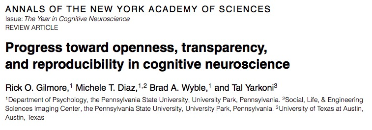
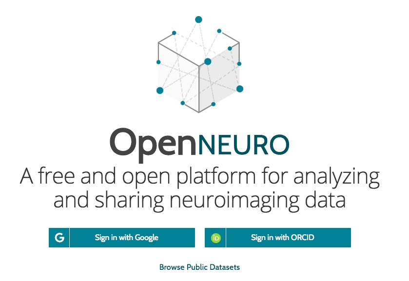

```{r setup, include=FALSE}
knitr::opts_chunk$set(echo = FALSE)
```

# Preliminaries

---


</br>


</br>


<!-- Funding sources with icons -->

## About me

- Associate Professor of Psychology
- Founding Director of Human Imaging, PSU [SLEIC](http://imaging.psu.edu)
- Co-Founder/Co-Director [Databrary.org](http://databrary.org)

---

- Ph.D. in psychology (cognitive neuroscience), Carnegie Mellon University
- B.A. in cognitive science, Brown University
- vision, perception & action, brain development, open science

---

- Denver native, husband & father of two daughters
- ham (K3ROG), actor/singer, banjo-picker, hiker/cyclist, coder

# The Frontier Within

## Core questions for science

>1. How did the Universe begin?
>2. What is the origin of life?
>3. What is the nature of mind?

## Neuroscience is harder than physics

---

<div class="centered">

</div>

---

<div class="centered">

</div>

# What must the nervous system do?

## What behaviors are essential for animals to perform?

---

- Defense
- Ingestion
- Reproduction

---


<!-- Preserve, protect, defend... -->

---


<!-- Eat, drink, & be merry... -->

---


<!-- Be fruitful & multiply... -->

## What behaviors are essential for animals to perform?

---

- Perception at a distance
- Locomotion
- Object manipulation/consumption
- Signaling/communication

## How is the nervous system organized to shape these behaviors?

---

<div class="centered">
<a href="http://larrywswanson.com/wp-content/uploads/2015/06/4-systems-network.jpg">
</a>
</div>

---

<div class="centered">
<a href="http://larrywswanson.com/wp-content/uploads/2015/06/Willis-on-Steno-circuit.jpg">
</a>

[Swanson 2005](http://larrywswanson.com/wp-content/uploads/2015/06/Willis-on-Steno-circuit.jpg)
</div>

---

<div class="centered">
<a href="http://larrywswanson.com/wp-content/uploads/2015/06/Cajal-1893-Reflex.jpg">
</a>
</div>


## Perception -> Cognition -> Action Cycle

---

- What's out there?
- Where is it?
- How am I feeling now?
- What should I do about it?

---


[Fuster 2004](http://doi.org/10.1016/j.tics.2004.02.004)

## Phenomena span vast scales

---

<div class="centered">
<a href="http://www.nature.com/neuro/journal/v17/n11/images/nn.3839-F1.jpg">

</a>

[Sejnowski 2014](http://doi.org/10.1038/nn.3839)
</div>

---

> "*If understanding everything you needed to know about the brain is a mile, how far have we walked?*"

---

<iframe width="800" height="450" src="https://www.youtube.com/embed/nvXuq9jRWKE" frameborder="0" allow="autoplay; encrypted-media" allowfullscreen></iframe>

J. Lichtman, <https://www.youtube.com/watch?v=nvXuq9jRWKE&feature=youtu.be>

# Inching along...

## Metaphors for mind...


<!-- Descartes -->

---


<!-- Switchboard -->

---


<!-- Computer -->

---


<!-- Cell phone -->

---


<https://www.submarinecablemap.com/>

## Common themes

---

- Connectivity/communication
- Multiple components
- Inputs & outputs
- Information processing/computation
- Functional specialization

## The brain has many parts

<iframe width="800" height="500" src="https://www.youtube.com/embed/snO68aJTOpM?rel=0" frameborder="0" allow="autoplay; encrypted-media" allowfullscreen></iframe>

## Brain anatomy through dance

<div class="centered">
<audio controls>
  <source src="snd/brain_boxing-2.m4a">
</audio>
</div>

## Finding our way around

### **Anterior/Posterior**
### **Medial/Lateral**
### **Superior/Inferior**
### **Dorsal/Ventral**
### **Rostral/Caudal**

---

<div class="centered">


<!-- <https://upload.wikimedia.org/wikipedia/commons/thumb/e/e7/Blausen_0019_AnatomicalDirectionalReferences.png/800px-Blausen_0019_AnatomicalDirectionalReferences.png> -->
</div>

## Bipeds vs. quadripeds {.smaller}

<div class="centered">


<!-- <https://upload.wikimedia.org/wikipedia/commons/thumb/0/00/1303_Human_Neuroaxis.jpg/800px-1303_Human_Neuroaxis.jpg> -->
</div>

## The parts have special functions

## Hypothalamus & the "4 Fs"

- Fighting
- Fleeing
- Feeding
- Mating

---


<!-- Hypothalamus -->

# Nuts & bolts...

## Cells of the nervous system

- Glial ("glue") cells
- Nerve cells (neurons)

---

<div class="centered">

</div>

---

<iframe width="800" height="500" src="https://www.youtube.com/embed/H0K2dvB-7WY?rel=0" frameborder="0" allow="autoplay; encrypted-media" allowfullscreen></iframe>

## Neurons release neurotransmitters

---

<div class="centered">

</div>

## Monoamine Song

<iframe width="665" height="500" src="https://www.youtube.com/embed/gsjcb7w1Y-w" frameborder="0" allowfullscreen></iframe>

<https://en.wikipedia.org/wiki/Mah_Nà_Mah_Nà>

---

Monoamines, do-do do do-do</br>
Monoamines, do do do-do</br>
Monoamines, do do do do-do do do-do do do-do do do do do-do do

---

Monoamines, do-pa-mine is one</br>
Monoamines, norepi, too</br>
Monoamines, sero-tonin e-pinephrine, dop-a- mine, nor-epinephrine, melatonin, whoo!

---

Monoamines, mod-u-late neurons </br>
Monoamines, throughout the brain</br>
Monoamines, keep people happy, brains snappy, not sleepy, not sappy, do-do do-do do-do do

## Substances of use and abuse activate receptors

---

- Nicotine
- Alcohol
- Valium
- Prozac
- Opioids
- Marijuana

# How did it get here?

## The emergence of behavior

---


## What sparked the explosion?

- Behavior requires energy
- Behavior requires perception at a distance
- Behavior requires action
- Actions require problem solving, (sequence) planning, current state + stored information (memory)

## Evolving brains

## Developing brains

## Maintaining brains

# Where is neuroscience going?

---

<div class="centered">

</br>
<small>
([Baker, 2016](http://doi.org/10.1038/533452a))
</small>
</div>

<div class="notes">
Nature conducted a survey of some 1,600 scientists in 2016. They were asked this question and a few others. Here are the results.
</div>

---

<div class="centered">

</div>

---

<div class="centered">


<small>([Szucs & Ioannides, 2017](http://doi.org/10.1371/journal.pbio.2000797))</small>
</div>

<div class="notes">
As Szucs and Ioannides have shown based on an analysis of more than 10,000 papers in the cognitive neuroscience literature, sample sizes are small, and the probability of false negatives is high, especially for small to medium effect sizes.
</div>

---

<div class="centered">
> "Assuming a realistic range of prior probabilities for null hypotheses, false report probability is likely to exceed 50% for the whole literature."

<small>([Szucs & Ioannides, 2017](http://doi.org/10.1371/journal.pbio.2000797))</small>
</div>

<div class="notes">
So, this means that we may not know what we think we know.
</div>

## On the other hand...



---



<http://openneuro.org>

---

<video width="1000" data-autoplay>
  <source src="mov/neurosynth-happy.mp4" type="video/mp4">
Your browser does not support the video tag.
</video>
</br>
<http://neurosynth.org>

---

<iframe width="800" height="500" src="https://www.youtube.com/embed/zKyO_AB7aMc" frameborder="0" allow="autoplay; encrypted-media" allowfullscreen></iframe>

<http://humanconnectome.org>

---


[imaging.psu.edu](http://imaging.psu.edu)

---

<iframe width="800" height="500" src="https://www.youtube.com/embed/KDjWdtDyz5I" frameborder="0" allowfullscreen></iframe>

<div class="notes">
Effects of DBS for Parkinson's.
</div>

---


<!-- Convolutional neural networks -->

# The frontier within...

---

<div class="centered">
<a href="http://www.nature.com/neuro/journal/v17/n11/images/nn.3839-F1.jpg">

</a>

[Sejnowski 2014](http://doi.org/10.1038/nn.3839)
</div>

---

<div class="centered">
<video width="700" data-autoplay>
  <source src="https://nyu.databrary.org/slot/27087/0,79000/asset/119877/download?inline=true" type="video/mp4">
Your browser does not support the video tag.
</video>

$n=900$ 12-, 18-, 24-mo-olds; $n=30$ sites

## The human behavior-ome

<video height="600" controls data-autoplay>
  <source src="mov/Construction.mp4" type="video/mp4">
Your browser does not support the video tag.
</video>

*Source*: Ori Ossmy (NYU)

---

<iframe width="800" height="500" src="https://www.youtube.com/embed/JB7jSFeVz1U?rel=0" frameborder="0" allow="autoplay; encrypted-media" allowfullscreen></iframe>

<!-- Ode to the Brain -->

---

<video width="800" loop data-autoplay>
  <source src="https://github.com/gilmore-lab/DEVSEC-2018/blob/master/mov/databrary-splash.mp4?raw=true" type="video/mp4">
  </video>

rogilmore@psu.edu

<https://gilmore-lab.github.io>

<https://gilmore-lab.github.io/2018-10-OLLI/>

# Resources
